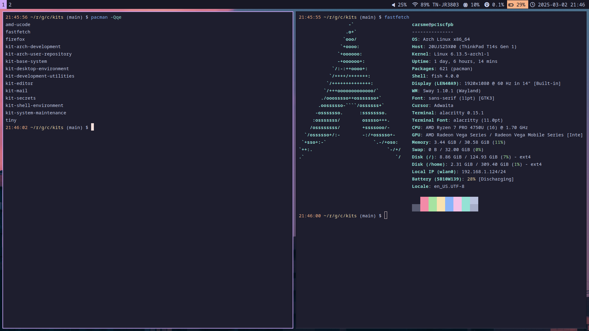

# Kits

A complement to dotfile repositories for achieving reproducible and organized
Arch Linux systems.

## What is a kit?

A _kit_ is functionally an Arch Linux package, but instead of packaging
software, it packages configuration, scripts and installs dependencies needed
for a high-level use-case. For example, my `kit-desktop-environment` installs a
fully featured Sway desktop environment, with a login manager, bar, launcher,
etc. - Not just Sway.

As packaging systems generally are the de facto standard for tracking installed
files on Linux distributions, kits conceptually aim to leverage that for
configuration as well.

While kits can be shared as built package artifacts or uploaded to custom
repositories, they don't have to. All that is needed to build and install my
kits from this repository is makepkg, see [Installation](#installation).

Some nice things about kits:

- **They organize installed packages and reduce the number of explicitly
  installed ones.** Before conceptualizing kits, my system had around 150
  explicitly installed packages (see yours by running `pacman -Qqe`). In that
  long list there were clear groups of packages being used to together to
  fulfil a use-case.

  Using the desktop environment as example again, just installing Sway does not
  get you very far - the `kit-desktop-environment` package depends on 26
  packages and should work out-of-the-box as it installs all the necessary
  dependencies and a corresponding configuration.

- **They offload and complement dotfile repositories.** Migrating configuration
  that is only relevant for Arch Linux, that rarely changes, or that fits the
  package format nicely can offload large dotfile repositories.

- **They offer a way to provide the "out-of-the-box" experience other distros
  have.** While the "do it yourself" philosophy of Arch Linux is something I
  value and appreciate, I've also felt there is room for a more ready-made
  experience. The idea is that Arch Linux + kits would be able to provide just
  that. If you want to use Arch Linux, but you don't necessarily want to theme
  Sway + friends yourself, then installing an appropriate kit might be a good
  option.

## Kits in this repository

Note that categorization is hard, so these categories/kits are very much a work
in progress. My initial goal has been apply the kit-concept on my system and
use-cases, not to produce something that is generic and easily reusable. I am
however interested in exploring that path, long-term.

Kits installing fundamental stuff:

- **kit-base-system:** Installs e.g. the kernel and other fundamental stuff.

- **kit-shell-environment:** Installs my shell of choice, [fish][], along with
  some programs that are key to the command-line, such as Git and OpenSSH.

- **kit-desktop-environment:** Installs a desktop environment, [Sway][]. Fully
  featured with login manager, launcher, bar, theme, and so on. Comes with the
  terminal emulator [Alacritty][].

After installing the kits above and following the post-install instructions,
you should end up with a desktop environment looking like this:



Note the small number of explicitly installed packages.

Kits installing applications:

- **kit-editor:** Installs the editor [Neovim][] along with some helper
  scripts.

- **kit-mail:** Installs the mail client [aerc][] and [Proton Mail Bridge][] to
  be able to connect to use [Proton Mail][].

Kits installing utilities:

- **kit-secrets:** Utilities for managing secrets, using [Bitwarden][] as vault
  with some secrets synced locally to a gopass store.

- **kit-arch-development:** Utilities useful for Arch Linux development and
  packaging.

- **kit-arch-user-repository:** Utilities for downloading packages from the
  [Arch Linux User Repository (AUR)][], specifically [aurutils][].

- **kit-development-utilities:** Generic development utilities (kind of a
  catch-all).

- **kit-system-maintenance:** Utilities for performing system maintenance.

Consistent throughout the kits is the theme [Catppuccin][] Mocha.

[fish]: https://fishshell.com/
[Sway]: https://swaywm.org/
[Alacritty]: https://alacritty.org/
[Neovim]: https://neovim.io/
[aerc]: https://aerc-mail.org/
[Proton Mail]: https://proton.me/mail
[Proton Mail Bridge]: https://github.com/ProtonMail/proton-bridge
[Bitwarden]: https://bitwarden.com/
[Arch Linux User Repository (AUR)]: https://aur.archlinux.org/
[aurutils]: https://github.com/aurutils/aurutils
[Catppuccin]: https://catppuccin.com/

## Installation

Build and install a kit from this repository by running:

```sh
make install-<kit>
```

After installation, follow the post-installation steps declared in the notice.

Uninstall by running:

```sh
make uninstall-<kit>
```
