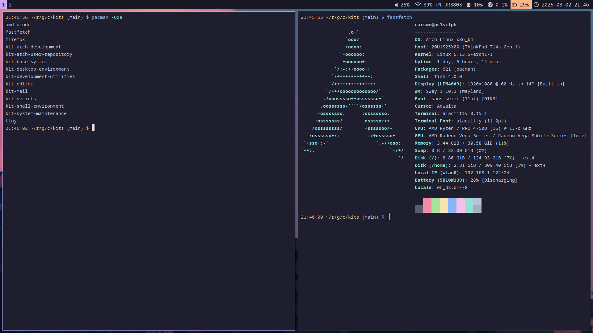

# Kits

A complement to dotfile repositories for achieving reproducible and organized
Arch Linux systems.

## What is a kit?

A _kit_ is functionally an Arch Linux package, but instead of packaging
software, it packages configuration, scripts and installs dependencies needed
for a high-level use-case. For example, my `kit-desktop-environment` installs a
fully featured Sway desktop environment, with a login manager, bar, launcher,
etc. - Not just Sway.

As packaging systems generally are the de facto standard for tracking installed
files on Linux distributions, kits conceptually aim to leverage that for
configuration as well.

While kits can be shared as built package artifacts or uploaded to custom
repositories, they don't have to. All that is needed to build and install my
kits from this repository is makepkg, see [Installation](#installation).

Some nice things about kits:

- **They organize installed packages and reduce the number of explicitly
  installed ones.** Before conceptualizing kits, my system had around 150
  explicitly installed packages (see yours by running `pacman -Qqe`). In that
  long list there were clear groups of packages being used to together to
  fulfil a use-case.

  Using the desktop environment as example again, just installing Sway does not
  get you very far - the `kit-desktop-environment` package depends on 34
  packages and should work out-of-the-box as it installs all the necessary
  dependencies and a corresponding configuration.

- **They offload and complement dotfile repositories.** Migrating configuration
  that is only relevant for Arch Linux, that rarely changes, or that fits the
  package format nicely can offload large dotfile repositories.

- **They offer a way to provide the "out-of-the-box" experience other distros
  have.** While the "do it yourself" philosophy of Arch Linux is something I
  value and appreciate, I've also felt there is room for a more ready-made
  experience. The idea is that Arch Linux + kits would be able to provide just
  that. If you want to use Arch Linux, but you don't necessarily want to theme
  Sway + friends yourself, then installing an appropriate kit might be a good
  option.

## Kits in this repository

The kits are grouped by how generic they are. The first group should be usable
by anyone who wants Arch Linux with Sway, the second is shaped by the tools I
happen to use.

More generic kits:

- **kit-base-system:** Installs what is needed to boot the machine: the kernel,
  microcode, networking, encrypted LVM, zram swap and power management.

- **kit-desktop-environment:** Installs a fully featured desktop environment,
  [Sway][], with login manager, launcher, bar, notifications, fonts, browser
  and theme. Comes with the terminal emulator [Alacritty][].

- **kit-installer:** Installs Arch Linux with kits from the live ISO, see
  [docs/installation.md](docs/installation.md).

After installing the kits above and following the post-install instructions,
you should end up with a desktop environment looking like this:



Note the small number of explicitly installed packages.

More bespoke kits:

- **kit-shell-environment:** Installs my shell of choice, [fish][], along with
  the command-line tools I use, such as Git, OpenSSH, ripgrep and direnv.

- **kit-editor:** Installs my editor, [Neovim][], along with the tools its
  configuration needs and some helper scripts.

- **kit-secrets:** Utilities for managing secrets, using [Bitwarden][] as vault
  with some secrets synced locally to a gopass store.

- **kit-mail:** Installs the mail client [aerc][].

- **kit-arch-development:** Utilities useful for Arch Linux development and
  packaging.

Consistent throughout the kits is the theme [Catppuccin][] Mocha.

[fish]: https://fishshell.com/
[Sway]: https://swaywm.org/
[Alacritty]: https://alacritty.org/
[Neovim]: https://neovim.io/
[aerc]: https://aerc-mail.org/
[Bitwarden]: https://bitwarden.com/
[Catppuccin]: https://catppuccin.com/

## Installation

### Install a system with kit-installer

To install Arch Linux with kits from the live ISO, see
[docs/installation.md](docs/installation.md).

### Install pre-built kits with pacman

To install pre-built packages from the custom repository at
<https://carlsmedstad.github.io/kits/>, add the following to your
`pacman.conf`:

```ini
[kits]
Server = https://carlsmedstad.github.io/kits
```

And install the kits as you would any other package:

```sh
sudo pacman -Syu <kit>
```

### Test kits in a virtual machine

To try the installer and the kits in QEMU before touching real hardware, see
[docs/testing.md](docs/testing.md).

### Build kits from source with makepkg

To build and install a kit from source using makepkg, run:

```sh
make install-<kit>
```

Uninstall by running:

```sh
make uninstall-<kit>
```
